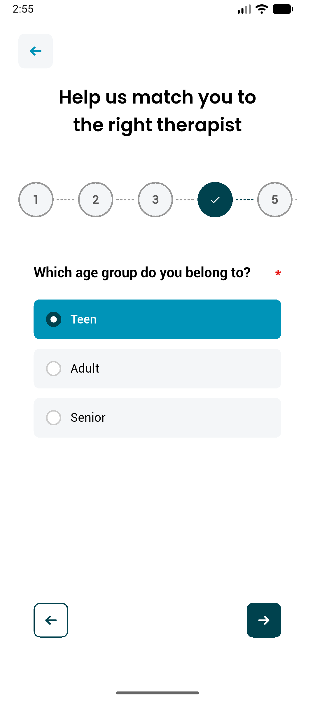
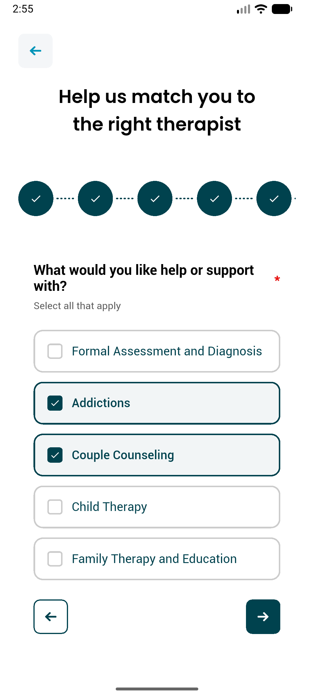
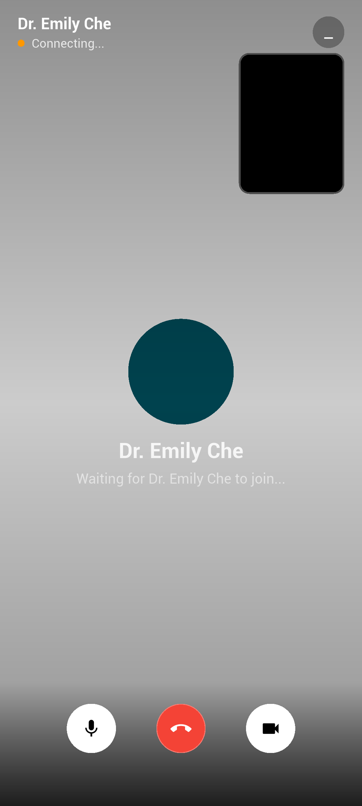
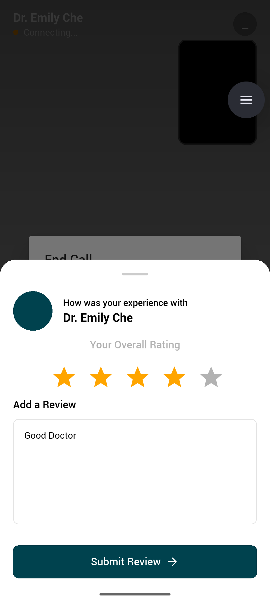
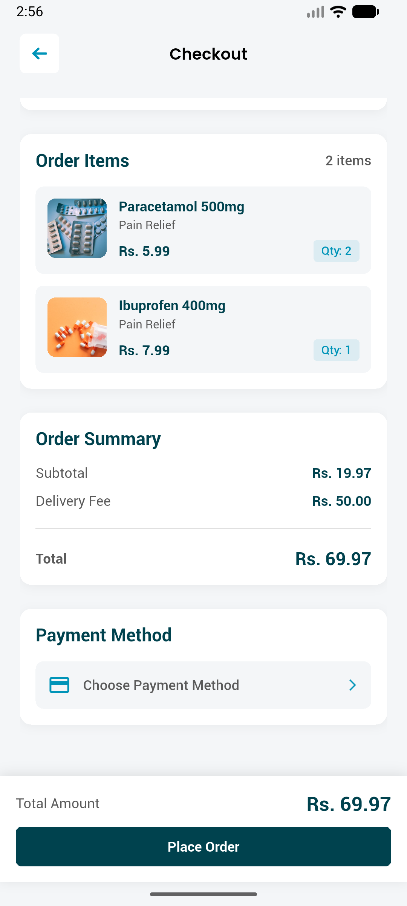
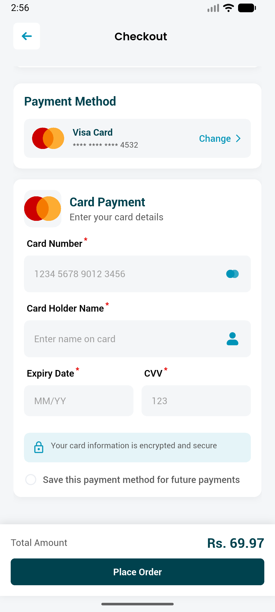
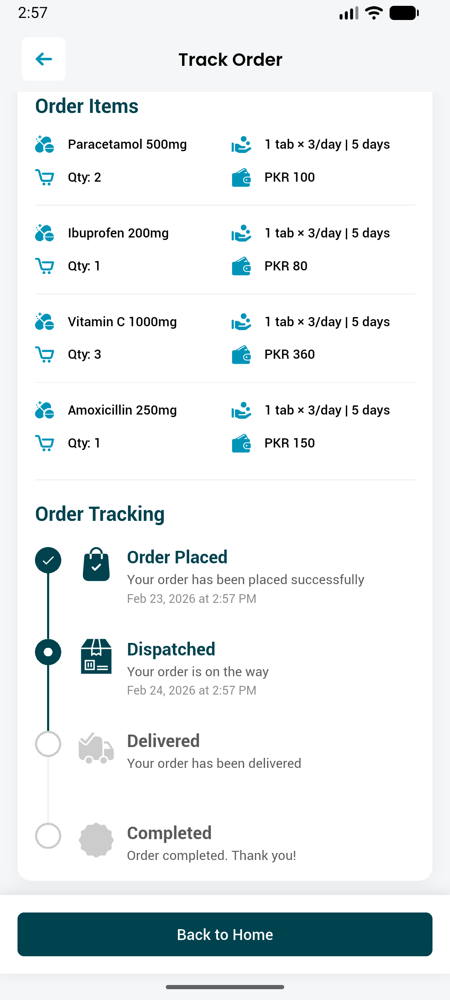

# Telehealth Recovery App

A production-grade **cross-platform telehealth mobile application** built with Flutter, following Clean Architecture principles. Designed for recovery and rehabilitation services, it connects patients with specialist doctors through a fully integrated digital health platform.

---

## Demo Videos

<p align="center">
  <video src="screenshots/demo_1.mp4" width="360" controls></video>
  &nbsp;&nbsp;
  <video src="screenshots/demo_2.mp4" width="360" controls></video>
</p>

---

## Screenshots

### Therapist Matching & Questionnaire Flow

<p align="center">
  
  &nbsp;&nbsp;
  
</p>
<p align="center">
  <em>Step-by-step questionnaire to intelligently match patients with the right therapist</em>
</p>

---

### Video Consultation (Agora RTC)

<p align="center">
  
  &nbsp;&nbsp;
  
</p>
<p align="center">
  <em>Live video session via Agora RTC — post-call doctor rating and review</em>
</p>

---

### Pharmacy & Medicine Ordering

<p align="center">
  
  &nbsp;&nbsp;
  
  &nbsp;&nbsp;
  
</p>
<p align="center">
  <em>Full pharmacy flow — order items, card payment, and real-time order tracking</em>
</p>

---

### Consultation Payment

<p align="center">
  
</p>
<p align="center">
  <em>Consultation fee breakdown with multiple payment method support</em>
</p>

---

## Overview

This app serves three distinct user roles — **Patients**, **Doctors (Specialists)**, and **Admins** — each with a dedicated feature set. Patients can discover specialists, book consultations, attend live video sessions, and order medicines. Doctors manage their schedules, patients, and earnings. Admins oversee the full platform including users, sessions, payments, and pharmacy inventory.

---

## Tech Stack

| Category | Technology |
|---|---|
| Framework | Flutter (Dart) — Android & iOS |
| State Management | GetX |
| Architecture | Clean Architecture (Data / Domain / Presentation) |
| Networking | Dio + Retrofit + Code Generation |
| Video Calling | Agora RTC Engine |
| Authentication | JWT + Flutter Secure Storage |
| Social Login | Google Sign-In |
| Serialization | JSON Annotation + JSON Serializable |
| Storage | GetStorage + Shared Preferences |
| Push Notifications | Firebase Cloud Messaging (FCM) |
| Localization | Easy Localization |
| Dependency Injection | Manual DI via service locator pattern |
| Payments | Stripe / JazzCash / Easypaisa |
| UI | Material Design + Custom Widgets + SVG |

---

## Architecture

The project is structured around **Clean Architecture**, separating concerns into three layers:

```
lib/
├── app/               # App-wide config — routes, constants, services, utils
├── data/              # Data layer — API clients, datasources, mappers
├── domain/            # Domain layer — entities, repository interfaces, use cases
├── presentation/      # UI layer — screens, controllers, widgets
└── di/                # Dependency injection bindings
```

### Design Patterns Used
- **Repository Pattern** — abstracts data sources behind domain interfaces
- **Use Case Pattern** — each business operation is encapsulated in its own class (47 use cases)
- **MVC/GetX Controllers** — reactive UI with minimal boilerplate
- **Mapper Pattern** — decouples API models from domain entities

---

## Features

### Patient
- Onboarding flow with questionnaire-based therapist matching
- Secure authentication — Email/Password, Google Sign-In, OTP verification
- Forgot password and reset password flows
- Browse and search specialist directory with filters
- Book and manage consultation appointments
- Live video consultations via Agora RTC
- Medicine ordering from integrated pharmacy
- Payment processing with multiple gateways and payment history
- Session history and consultation notes
- Doctor ratings and reviews
- Profile management and settings

### Doctor (Specialist)
- Registration with approval workflow
- Professional profile management
- Session scheduling and management
- Patient directory with full history
- Session notes and prescription creation
- Earnings dashboard and withdrawal history

### Admin
- User management — approve, suspend, or edit doctor and patient accounts
- Session monitoring and control
- Payment and withdrawal tracking
- Pharmacy product and inventory management
- Medicine order management
- Ad banner creation and management
- Featured product management
- Global session discount configuration

---

## Project Structure

```
lib/
├── app/
│   ├── config/                  # Colors, routes, constants
│   ├── controllers/             # Base GetX controller
│   ├── environments/            # Environment configs
│   ├── mixins/                  # Shared mixins
│   ├── services/                # App-level services
│   ├── utils/                   # Utilities and helpers
│   └── widgets/                 # Shared UI components
│
├── data/
│   ├── api/                     # Retrofit API interfaces + generated clients
│   ├── datasource/              # Remote and local data sources
│   ├── mapper/                  # DTO → Entity mappers
│   ├── models/                  # API response models
│   └── repository/              # Repository implementations
│
├── domain/
│   ├── entity/                  # Core domain entities
│   ├── enums/                   # Domain enumerations
│   ├── models/                  # Domain models
│   ├── repositories/            # Repository contracts (interfaces)
│   └── usecase/                 # 47 use cases (one per business operation)
│
├── presentation/
│   ├── widgets/                 # Reusable UI widgets
│   ├── splash/                  # Splash & onboarding
│   ├── login_page/              # Authentication screens
│   ├── patient_home/            # Patient home screen
│   ├── book_consultation/       # Booking flow
│   ├── video_call/              # Agora video session
│   ├── pharmacy/                # Pharmacy & medicine ordering
│   ├── payments/                # Payment flow
│   ├── admin/                   # Admin dashboard
│   └── [40+ feature screens]/
│
├── di/                          # Dependency injection
└── gen/ / generated/            # Auto-generated asset references & locales
```

---

## Getting Started

### Prerequisites

- Flutter SDK `^3.6.0`
- Dart SDK `^3.6.0`
- Android Studio or Xcode (for device/emulator)

### Setup

1. **Clone the repository**
   ```bash
   git clone https://github.com/buildwith-Usman/telehealth-recovery-app-public.git
   cd telehealth-recovery-app-public
   ```

2. **Install dependencies**
   ```bash
   flutter pub get
   ```

3. **Run code generation** (required for Retrofit API clients and JSON serialization)
   ```bash
   dart run build_runner build --delete-conflicting-outputs
   ```

4. **Generate locale files**
   ```bash
   chmod +x gen.sh && ./gen.sh
   ```

5. **Run the app**
   ```bash
   flutter run
   ```

---

## Development Commands

```bash
# Run in debug mode
flutter run

# Build Android APK
flutter build apk --release

# Build Android App Bundle
flutter build appbundle --release

# Build iOS (requires macOS + Xcode)
flutter build ios --release

# Watch and auto-regenerate code
dart run build_runner watch --delete-conflicting-outputs

# Analyze code quality
flutter analyze

# Run tests
flutter test

# Clean build cache
flutter clean && flutter pub get

# Check for outdated packages
flutter pub outdated
```

---

## Key Dependencies

| Package | Purpose |
|---|---|
| `get` | State management and routing |
| `dio` + `retrofit` | Type-safe HTTP networking |
| `agora_rtc_engine` | Real-time video calling |
| `flutter_secure_storage` | Secure token storage |
| `google_sign_in` | OAuth via Google |
| `easy_localization` | Multi-language support |
| `json_serializable` | JSON code generation |
| `image_picker` | Camera and gallery access |
| `table_calendar` | Appointment scheduling UI |
| `pin_code_fields` | OTP input |
| `connectivity_plus` | Network status detection |

---

## What This Project Demonstrates

- **Clean Architecture** applied at scale in a Flutter codebase
- **Multi-role application design** (Patient / Doctor / Admin) with role-based navigation
- **Real-time features** — live video consultations using Agora WebRTC
- **Complete auth flows** — JWT, OTP, Google OAuth, secure token storage
- **E-commerce patterns** — pharmacy ordering, cart, and payment integration
- **Code generation** — Retrofit API clients, JSON serializers, asset references
- **Separation of concerns** — 47 isolated use cases, repository abstraction, mapper layer
- **Production-ready patterns** — dependency injection, environment configs, error handling

---

## Contact

**Muhammad Usman**
Flutter Developer
Email: buildwithusman@gmail.com
GitHub: [github.com/buildwith-Usman](https://github.com/buildwith-Usman)

---

> This repository is a **public portfolio version** of the project, shared for demonstration purposes.
